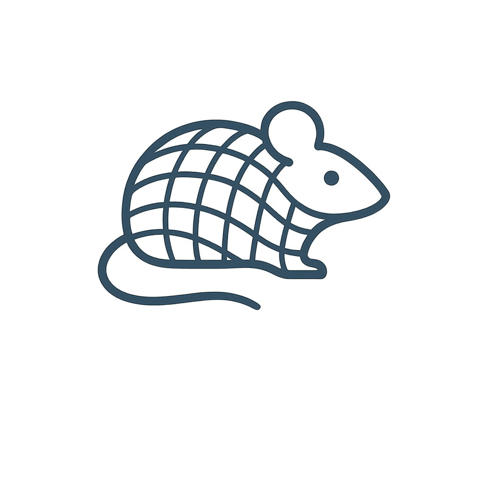
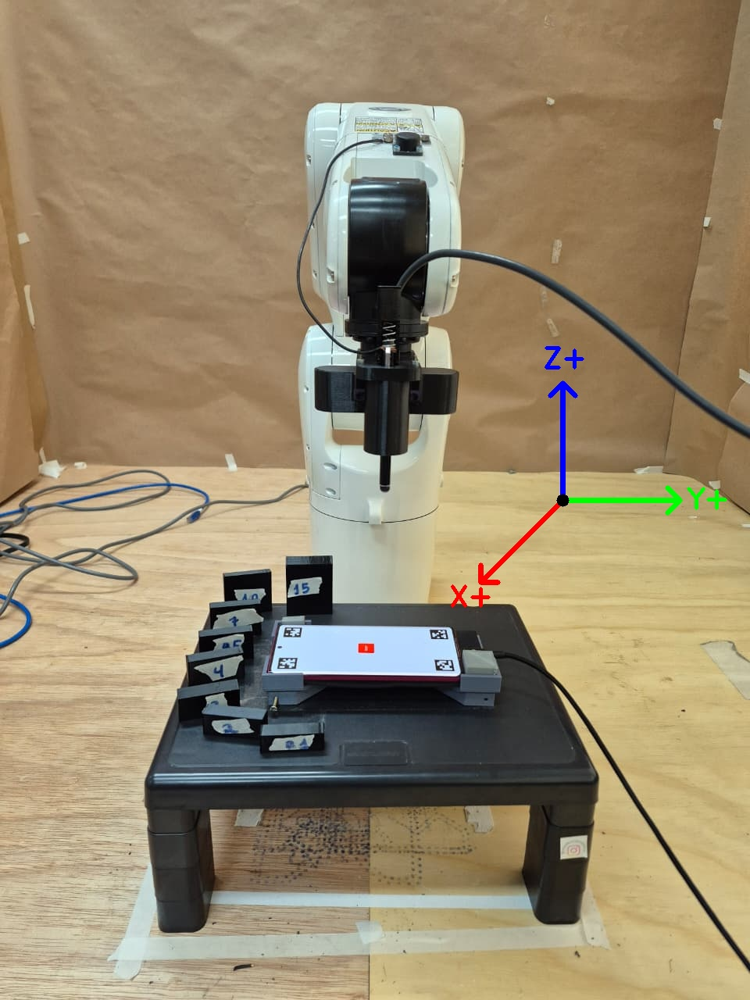
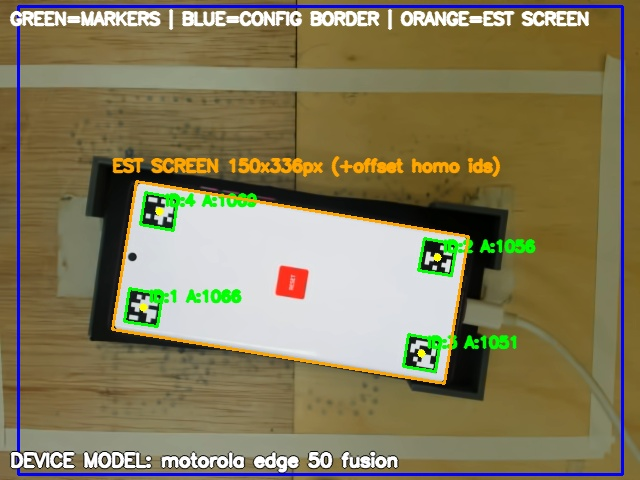
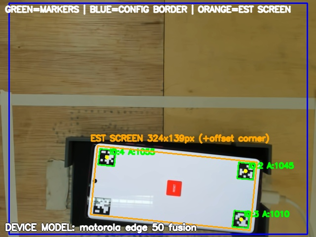
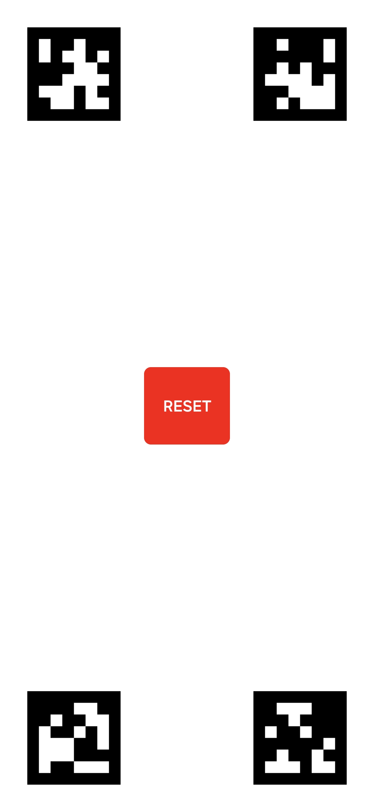
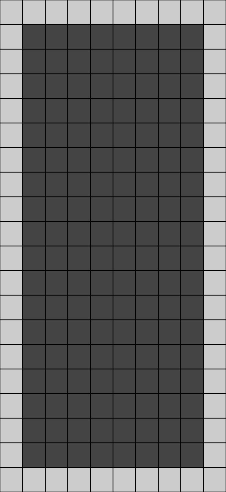
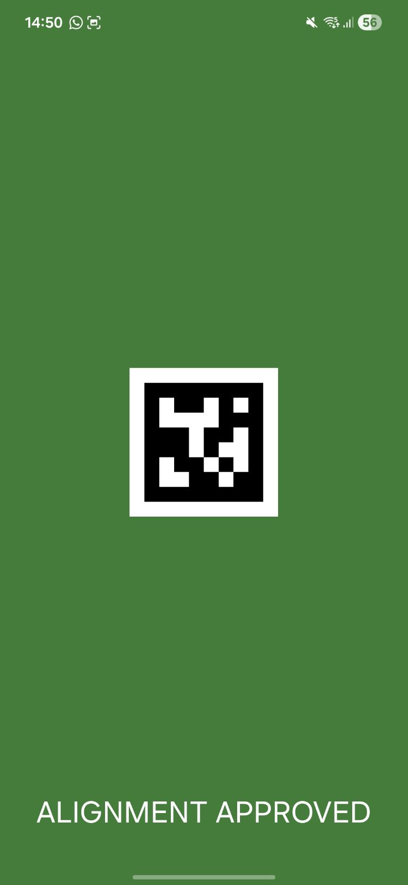
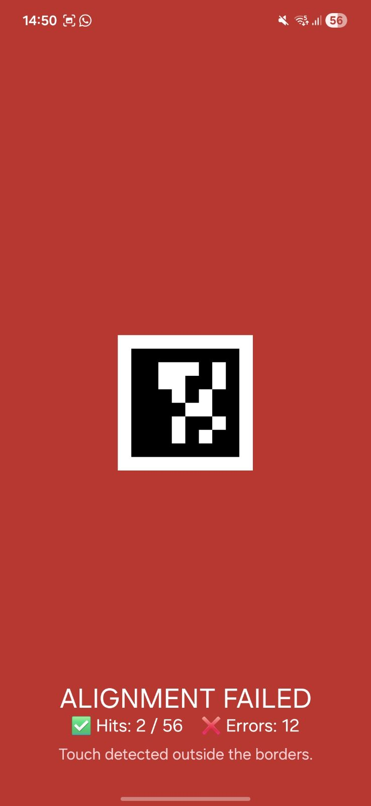
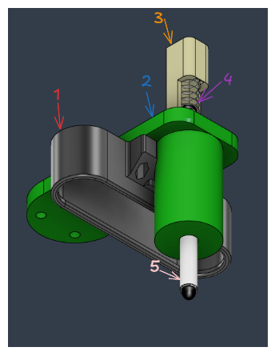

# Robot Touch Alignment (RTA)

<div align="center">
  
  <h3 align="center">A Visuomotor Alignment System for Test Automation on Touch-Sensitive Devices</h3>
</div>

<div align="center">
  
  
  
  
  
</div>

---

- [Robot Touch Alignment (RTA)](#robot-touch-alignment-rta)
  - [Overview](#overview)
  - [Introduction](#introduction)
  - [Motivation](#motivation)
  - [System Architecture](#system-architecture)
  - [Finite State Machine (FSM)](#finite-state-machine-fsm)
    - [UPPAAL Model](#uppaal-model)
  - [Requirements](#requirements)
    - [Hardware Requirements](#hardware-requirements)
    - [Software Requirements](#software-requirements)
  - [Physical Setup](#physical-setup)
    - [Workspace Height Constraint](#workspace-height-constraint)
    - [3D Models and End-Effector](#3d-models-and-end-effector)
    - [Touch Convergence Height (Z)](#touch-convergence-height-z)
        - [How to perfom the Z calibration](#how-to-perfom-the-z-calibration)
    - [End-Effector Offset Calibration (X/Y)](#end-effector-offset-calibration-xy)
        - [How to perfom the X/Y calibration](#how-to-perfom-the-xy-calibration)
      - [Robot setup with axis reference for X/Y/Z offset calibration](#robot-setup-with-axis-reference-for-xyz-offset-calibration)
  - [Workspace Calibration](#workspace-calibration)
    - [Camera Setup](#camera-setup)
    - [ROI](#roi)
      - [ROI Vision Examples](#roi-vision-examples)
      - [Properly Framed ROI](#properly-framed-roi)
      - [Occlusion and Visual Interference Example](#occlusion-and-visual-interference-example)
      - [ROI Calibration](#roi-calibration)
        - [How to perfom the ROI position](#how-to-perfom-the-roi-position)
    - [Closed-Loop Touch Validation](#closed-loop-touch-validation)
    - [Spatial Interpolation Mapping](#spatial-interpolation-mapping)
  - [Operational Constraints and Recommendations](#operational-constraints-and-recommendations)
  - [Experimentally Validated Features](#experimentally-validated-features)
  - [Installation](#installation)
    - [Environment Configuration](#environment-configuration)
    - [Project Installation](#project-installation)
    - [RTA Android App](#rta-android-app)
  - [Quick Start](#quick-start)
  - [Primary Usage](#primary-usage)
  - [Visual Demonstrations](#visual-demonstrations)
    - [RTA Android App](#rta-android-app-1)
      - [Main App Interface](#main-app-interface)
      - [Execution Visual Feedback](#execution-visual-feedback)
      - [End-Effector](#end-effector)
    - [Full System Execution](#full-system-execution)
      - [Execution — Part 1](#execution--part-1)
      - [Execution — Part 2](#execution--part-2)
  - [Module Reference](#module-reference)
    - [Orchestration Layer](#orchestration-layer)
    - [Alignment Layer](#alignment-layer)
    - [Device \& App Layer](#device--app-layer)
    - [Vision Layer](#vision-layer)
    - [Utilities](#utilities)
  - [Troubleshooting](#troubleshooting)
    - [Robot Connection Issues](#robot-connection-issues)
    - [Multiple ADB Devices Error](#multiple-adb-devices-error)
    - [Marker Detection Instability](#marker-detection-instability)
  - [Best Practices](#best-practices)
  - [Conclusion](#conclusion)

---

## Overview

The **Robot Touch Alignment (RTA)** project is a visuomotor module to automate interactions with touchscreens using a DENSO industrial robot, computer vision, and touch-driven calibration.

The system combines:

- robotic control;
- marker-based visual alignment;
- integration with an Android test app;
- touch-event feedback from Android;
- and orchestration via a finite state machine (FSM),

to create a repeatable, portable calibration and test workflow for mobile devices.

This documentation covers the project overview, motivation, installation via Poetry, Android app installation, primary usage, and module structure.

## Introduction

RTA was developed to automate the robot alignment relative to a mobile device by using a camera mounted to the robot to detect visual markers, estimate the target pose, and run a touch routine that produces the final workspace map. The goal is to transform a physical calibration session into a reproducible process with visual validation, Android feedback, and map persistence for later use.

The main system flow includes:

- launching the Android test application;
- detecting markers with the robot-mounted camera;
- rotation and position alignment;
- sequential touch execution;
- visual validation of results;
- and map/report generation.

## Motivation

This project aims to reduce operational friction when testing mobile devices by automating interactions with robots. Instead of scattering control, vision, and device management logic across isolated scripts, RTA centralizes these responsibilities in a reusable and predictable structure.

Primary goals:

- ease reproducing the setup on new machines;
- simplify running the main flow with a single command;
- keep the codebase organized for integration with other projects;
- encapsulate ORiN2 SDK and DCOM complexities behind local reusable modules;
- enable installation via `poetry install`.

## System Architecture

```text
Android App
  |
  v
ADB + Socket Communication
  |
  v
FSM in Python (RTA)
  |
  v
Vision + Alignment Layer
  |
  v
DENSO Robot Controller
  |
  v
Touch Execution
```

## Finite State Machine (FSM)

Main FSM flow:

```text
idle
-> connect_robot
-> motor_on
-> move_to_roi
-> camera_on
-> detect_markers
-> calibrate_z_touches
-> generate_map
-> swipe_borders
-> safe_pose
-> read_final_marker
-> save_map
-> motor_off
-> done
```

Any unrecoverable failure drives the FSM to the `error` state.

### UPPAAL Model

The RTA finite state machine is also modeled in UPPAAL for formal visualization and state-flow validation.

📄 Full UPPAAL FSM Diagram:

[docs/rta_materials/Rta_uppal.pdf](docs/rta_materials/Rta_uppal.pdf)

🧩 UPPAAL XML Source:

[utils/uppal/rta_new_corrected.xml](utils/uppal/rta_new_corrected.xml)

Because of the FSM's size and complexity, the full diagram is not embedded directly in this README.

This explicit modeling shows that:

- ✅ the FSM has a formal model;
- ✅ the model is documented and traceable to the implementation;
- ✅ the UPPAAL XML is included in the repository for inspection;
- ✅ the system complexity justifies formal modeling.

The Python implementation in `state_machine/` follows the same execution flow defined in the UPPAAL model, providing traceability between model and code. This connection highlights that RTA is not only a robotic script implementation, but a formally-modeled, implemented, and documented system.

---

## Requirements

### Hardware Requirements

- DENSO robot with a controller reachable on the network;
- Android device for running the RTA app;
- 3D models for the end-effector that mount the BRIO camera and the touch actuator (available in `docs/rta_materials/rta_endeffector_model_3d/`);
- Camera mounted on the robot head or end-effector with a clear view of the workspace;
- 3D-printed support fixed to the robot;
- USB cable for ADB connection to the Android device;
- Adequate lighting for reliable marker detection.

### Software Requirements

- Python 3.11+;
- Poetry;
- ADB available on the system (`adb` on PATH);
- ORiN2 SDK installed and configured.

---

## Physical Setup

Before running the RTA workflow, calibrate the physical setup of the robot and end-effector. Due to 3D-printing tolerances, camera mount variations, actuator placement differences, and workspace geometry, some parameters must be manually adjusted per physical setup.

This calibration is essential to improve touch convergence speed, reduce residual alignment error, increase operational safety, and preserve repeatability across runs.

Typically this setup is performed once per robot, end-effector, camera mount, or workspace geometry. Repeat it when any of these change.

### Workspace Height Constraint

**Place the device approximately 14 cm above the workstation floor** to avoid kinematic singularities and unstable robot trajectories during execution.

As shown below, a raised black support platform is used to elevate the device and keep safer robot motion paths.


### 3D Models and End-Effector

The 3D models for the end-effector components are located in `docs/rta_materials/rta_endeffector_model_3d/`. Download, review, and 3D-print these parts before proceeding. We recommend PETG or PLA for durability and precision. To see the image of the end-effector, check the [End-Effector](#end-effector) section.

### Touch Convergence Height (Z)

The `Z_OFFSET_BEFORE_TOUCH` is the distance that the script adds to the calibrated touch plane height (`Z_TOUCH`) to define the robot's approach position before making contact with the device screen.

Configure the approach height before physical contact using:

```python
Z_OFFSET_BEFORE_TOUCH = 20.0
```


The `Z_TOUCH` variable defines the calibrated Z-axis height where the robot makes contact with the device screen during touch execution. Set this value based on the physical calibration process described below.

```python
Z_TOUCH = 260.98
```

**`Z_TOUCH` must be calibrated for each robot and workspace.** This value depends on workspace height, device thickness, support geometry, bench inclination, actuator assembly, and end-effector mounting.

Incorrect values may cause failed capacitive touches, excessive pressure on the display, unstable touch detection, or mechanical damage to the device surface.

##### How to perfom the Z calibration


To perform Z-axis calibration, it is necessary to define the position of the ROI (region of interest) and move the robot along the Z-axis until it touches the device screen from ROI position using the Pendant. Then, it is necessary to read the robot's Z-coordinate and set this value in the `Z_TOUCH` variable. If need be, adjust the `Z_OFFSET_BEFORE_TOUCH` to ensure the robot approaches the screen correctly before making contact.

### End-Effector Offset Calibration (X/Y)

The system assumes a fixed spatial offset between the camera optical center and the physical touch actuator. These offsets are configured in `config.py`:

```python
TOUCH_FINGER_OFFSET_X = -30.1
TOUCH_FINGER_OFFSET_Y = 0.0
```

The nominal CAD distance between the **camera center and the actuator is roughly 31.5 mm**. However, due to Fused Deposition Modeling (FDM) tolerances, assembly variations, mechanical deformation, and camera positioning differences, **the actual offset must be experimentally calibrated for each physical setup.**

Offsets are expressed in the robot Cartesian frame and represent the displacement between the camera optical center and the touch actuator tip.


##### How to perfom the X/Y calibration
To perform X/Y offset calibration, first place the robot in the ROI position and execute the FSM using the command described in the [Primary Usage](#primary-usage) section.

During this procedure, only a single successful interaction with a fiducial marker is required.

Observe how the end-effector approaches and touches the marker center. Once the robot performs the touch routine in one fiducial marker, stop the execution using **CTRL+C**. Then, adjust the `TOUCH_FINGER_OFFSET_X` and `TOUCH_FINGER_OFFSET_Y` values iteratively until the robot consistently touches the central area of the marker during alignment.


#### Robot setup with axis reference for X/Y/Z offset calibration

<p align="center">
  
</p>

This reference helps visualize the robot setup and the Cartesian axis orientation, clarifying the relation between the camera, the capacitive tip, and the X/Y offsets used in calibration.

Incorrect X/Y calibration can cause systematic touch displacement, marker alignment drift, unstable convergence behavior, or inaccurate interpolation mapping.

---

## Workspace Calibration

After the physical setup is complete, perform workspace calibration before running the full routine. This stage defines the logical parameters the system needs to operate correctly.

Repeat calibration when changing the robot, modifying the physical bench, replacing the end-effector, changing the camera mount, or altering the workspace geometry.

### Camera Setup

Camera Setup varies by hardware.

**For BRIO cameras:**

1. Install Logi Tune (or equivalent) and adjust focus, exposure, white balance, etc.
2. Run the configuration extraction script after tuning:

```bash
python utils/get_camera_configurations.py
```

3. The script outputs the camera settings. Copy the resulting values into `config.py` and update:

```python
CAMERA_CALIBRATION_CONFIG = {
    "auto_focus": <value>,
    "fixed_focus": <value>,
    "auto_exposure": <value>,
    "fixed_exposure": <value>,
    "auto_white_balance": <value>,
    "white_balance_temperature": <value>,
}
```

For other cameras, follow the camera vendor tools or API and update `CAMERA_CALIBRATION_CONFIG` accordingly.

Recalibrate when a new camera is installed, the lens changes, lighting conditions change significantly, or the camera mount position changes.


### ROI

The Region of Interest (ROI) is the predefined physical area where the smartphone should be placed for calibration. The robot moves to this region before starting visual detection, alignment, touch convergence, and interpolation mapping.

The ROI defines:

- where the device is expected to appear;
- the initial robot approach region;
- the visual acquisition area.

The smartphone must remain fully visible inside the ROI during execution. Correct ROI configuration is critical for stable marker detection, collision avoidance, and touch convergence performance.

#### ROI Vision Examples
Bellow are examples of how the ROI can be visually framed from the robot camera's perspective, highlighting ideal and non-ideal conditions for marker detection and alignment.

#### Properly Framed ROI

<p align="center">
  
</p>

In this configuration the device is fully visible, markers are detectable, and lighting is suitable for visual alignment. This is the ideal scenario for stable marker detection, automatic alignment, and touch convergence.

#### Occlusion and Visual Interference Example

<p align="center">
  
</p>

This example shows a non-ideal condition where parts of the ROI can be obstructed, the robot partially interferes with the field of view, or lighting degrades marker detection. Such situations may cause alignment failures, loss of detection, increased convergence time, or transitions to FSM error states.

**Important:** avoid perpendicular lighting directly on the device screen, as reflections can significantly reduce marker contrast.

#### ROI Calibration

There is dictionary in config.py called `ROI_POSITIONING_CONFIG` that contains the ROI position parameters. Adjust these values based on the physical setup and camera view to ensure the device is fully visible and markers are detectable.

Below is an example of the ROI configuration:

```python
ROI_POSITIONING_CONFIG = {
    "ROI_X": 331.07,
    "ROI_Y": 0.62,
    "ROI_Z": 421.36,
    "DEFAULT_FIG": 5,
}
```

##### How to perfom the ROI position

To calibrate the ROI position, first place the robot in a safe position with a clear view of the workspace using the Pendant. Then, adjust the `X`, `Y`, and `Z` cartesian values iteratively while observing the camera feed to ensure that the device is fully visible within the ROI and that fiducial markers can be reliably detected.


### Closed-Loop Touch Validation

RTA validates physical interactions using Android touch events as ground truth.

While the robot contacts the screen, Android reports the exact touch coordinates via ADB (`getevent`). This creates a deterministic closed-loop validation that can:

- confirm physical contact;
- validate touch precision;
- detect capacitive failures;
- and improve operational safety.

### Spatial Interpolation Mapping

Instead of relying only on projective vision, RTA builds a physical interpolation map from real touch contact points.

The robot performs validated touches on fiducial markers and records the Cartesian coordinates of each contact. Using these anchors, the system reconstructs a 3D interpolation mesh that can:

- compensate for device inclination;
- compensate uneven surfaces;
- preserve touch precision;
- and improve repeatability for future interactions.

---


## Operational Constraints and Recommendations

RTA relies on stable visual and mechanical conditions for reliable alignment.

For best results:

- avoid direct perpendicular lighting on the device screen;
- avoid strong reflections on glossy displays;
- keep the device fully inside the camera ROI;
- ensure the end-effector remains perpendicular to the screen surface;
- verify that the custom touch actuator maintains capacitive conductivity.

Extreme reflective conditions and excessive workspace inclination may still reduce marker detection reliability.

## Experimentally Validated Features

RTA was experimentally validated with:

- multiple Android devices;
- curved-edge displays;
- tilted surfaces;
- dynamic ArUco generation;
- closed-loop touch validation via ADB;
- sub-millimeter repeatability;
- and automatic interpolation-based calibration.

The system also demonstrated successful operation under surface inclinations, repeatable touch convergence, and reproducible calibration workflows.

---

## Installation

Follow these steps to prepare the environment once the requirements are met.

### Environment Configuration

This repository is prepared for installation via Poetry. The Aether SDK is declared in `pyproject.toml` and will be resolved automatically with the project's other dependencies.

Running `poetry install` installs all required dependencies without extra manual steps for Aether.

### Project Installation

```bash
poetry install
```

After installation the environment will be ready to run the main flow.

### RTA Android App

The RTA Android app must be installed on the phone so the FSM can execute correctly.

The repository includes a script to build and install the APK via ADB:

```powershell
.\scripts\install_rta_app.ps1
```

This script:

- builds the Android APK;
- installs the APK on the connected phone;
- places the artifact at `RTA_app/app/build/outputs/apk/debug/app-debug.apk`.

<!-- To install manually:
```bash
cd RTA_app
./gradlew installDebug
``` -->

Then run the main RTA flow.

## Quick Start

1. Connect the Android device via USB.
2. Connect the DENSO controller to the network.
3. Verify ADB connectivity.
4. Install dependencies with Poetry.
5. Run the main FSM script.

Suggested commands:

```powershell
adb devices
poetry install
.\scripts\install_rta_app.ps1
.\scripts\run_fsm.ps1 -WorkspaceName "RTA_WORKSPACE" -ControlName "rta" -RobotServerIp "111.111.111.111" -DeviceType "flat" -DeviceSide "portrait" -MaxSteps 120 -MetricsDir "test_results_custom"
```

## Primary Usage

After installing dependencies and the RTA app, the most common workflow is to run the main state machine.

Example using the project's PowerShell script:

```powershell
.\scripts\run_fsm.ps1 -WorkspaceName "RTA_WORKSPACE" -ControlName "rta" -RobotServerIp "111.111.111.111" -DeviceType "flat" -DeviceSide "portrait" -MaxSteps 120 -MetricsDir "test_results_custom"
```

Before running, adjust these parameters for your scenario:

- `-RobotServerIp`: IP address of the DENSO controller you are using;
- `-DeviceSide`: device orientation relative to the robot (`portrait` or `landscape`) relative to the robot's frontal plane;
- `-MetricsDir`: folder where results and the final map will be saved. If omitted, results are saved under `test_results/<device_model_or_device_type>/`.


The final map produced by RTA is stored by default at:

```text
test_results/<device_model_or_device_type>/physical_calibration_map_<timestamp>_<epoch>.json
```

In general, the expected flow of RTA module is:

1. start the Android app;
2. connect to the robot;
3. power on motors;
4. move to ROI;
5. detect markers;
6. align rotation and position;
7. execute the touch sequence;
8. save the final map;
9. safely power off the robot.

---

## Visual Demonstrations

This section groups RTA visual references by component to make the physical setup, Android app, and vision pipeline easier to follow.

### RTA Android App

The Android app is responsible for:

- showing visual markers;
- validating robot-executed touches;
- providing success/failure feedback;
- and integrating touch events with the FSM via ADB.

#### Main App Interface

<p align="center">
  
  
</p>

These screens represent the app's main states during calibration runs.

#### Execution Visual Feedback

<p align="center">
  
  
</p>

The app provides visual feedback for successful runs, interaction failures, touch errors, and invalid states encountered during a session.

#### End-Effector

<p align="center">
  
</p>

The image highlights:

1 - camera case;
2 - finger phalange connecting to the robot;
3 - touch actuator case;
4 - compression spring;
5 - actuator;

---

### Full System Execution

The GIFs below show a full run of the RTA main flow using a DENSO robot, computer vision, visual alignment, Android touch validation, and generation of the physical calibration map.

The presented execution corresponds to the full FSM routine, including marker detection, alignment, touch convergence, interpolation mesh generation, and automated swipes.

#### Execution — Part 1

- **Step 1**: ROI position
- **Step 2**: Find a marker, compare the distance, and move to the marker center.
- **Step 3**: Move down until the center of the marker is touched.

<p align="center">
  
</p>

This stage demonstrates the robot's initial approach, device visual acquisition, marker-based alignment, and the start of the physical calibration routine.

#### Execution — Part 2

- **Step 1**: Swipe ground-truth
- **Step 2**: ROI position
- **Step 3**: Calibration result

<p align="center">
  
</p>

In this stage the system performs physical point validation, interpolation map generation, automated swipes, and safe termination of the routine.

The GIFs show the real system behavior during FSM execution in a physical environment.

**Short FSM flow demonstrated by the GIFs**

```text
idle
-> connect_robot
-> motor_on
-> move_to_roi
-> detect_markers
-> calibrate_z_touches
-> generate_map
-> swipe_borders
-> done
```

---


---

## Module Reference

The project is organized in layers to keep responsibilities clear.

### Orchestration Layer

- `state_machine/`: contains the main RTA state machine;
- `state_machine/run_rta_fsm.py`: entrypoint for full execution.

### Alignment Layer

- `drivers/alignment/marker_detector.py`: marker detection and analysis;
- `drivers/alignment/rotation_alignment.py`: rotation (RZ) alignment;
- `drivers/alignment/auto_alignment.py`: automatic XYZ alignment.

### Device & App Layer

- `drivers/device/app_manager.py`: Android app control;
- `drivers/device/mobile.py`: touch event reading and device validations;
- `drivers/device/rta_integrated_controller.py`: orchestrates the full session.

### Vision Layer

- `drivers/vision/robot_camera.py`: robot camera capture;
- `drivers/vision/vision.py`: vision utilities and scripts.

### Utilities

- `utils/coordinate_transform.py`: camera-to-robot coordinate conversions;
- `utils/marker_touch_controller.py`: helpers for touch execution;
- `utils/calibration_map_exporter.py`: calibration map export.

---

## Troubleshooting

### Robot Connection Issues
```powershell
ipconfig
```
Run this command in the terminal to check your computer's IP address.

```powershell
ping <computer_ip>
```
Confirm the IP address of the DENSO controller is reachable from your computer via Pendant, using the computer's IP address obtained from `ipconfig`.


### Multiple ADB Devices Error

```powershell
adb disconnect
adb devices
```

Use only one USB device during a calibration session.

### Marker Detection Instability

- check lighting conditions;
- check camera focus;
- verify ROI positioning;
- confirm the phone orientation (`DeviceSide`).

---

## Best Practices

- Always power off motors and disconnect the robot after a run.
- Use `poetry install` to reproduce the environment on other machines.
- Verify ADB, camera and controller connectivity before running a real session.
- If the Android app crashes, restart it before starting a new session.
- Keep `DeviceSide` set correctly for the device in use (`portrait` or `landscape`).

## Conclusion

RTA provides a reproducible, modular module for robotic interaction with touch-sensitive devices.

By combining computer vision, robotic alignment, touch feedback, and a finite state machine, the project enables more reliable and portable automation flows for mobile device testing.